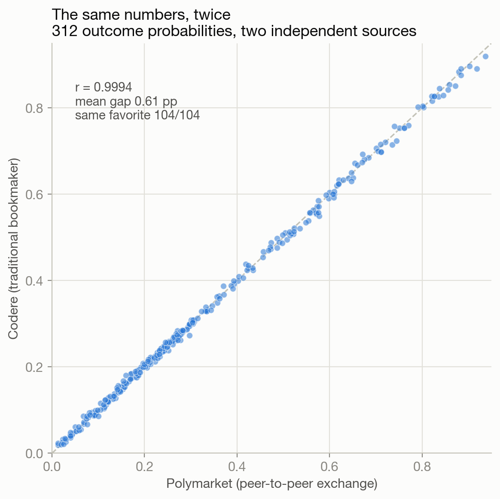

# Post-Mortem: Was It Skill?

The tournament is over. The pool had 641 players, the pot paid the top three,
and this project finished **4th by the rules set at the start** (711 points:
671 from matches, plus 30 for calling Spain champion and 10 for calling England
third). Two points short of the money.

This document asks the only three questions that matter after the fact, and
answers them with the 104-match dataset this repo accumulated. Every
probability was captured **before** kickoff, every result recorded after, and
every claim below regenerates from `analysis/final_report.py`.

1. **Was the result luck?** No: p ≈ 4.5×10⁻¹⁰ against a know-nothing picker.
2. **Did the probabilities keep their word?** Yes: promised 646 ± 42, delivered
   671, z = +0.58.
3. **Where did the edge actually come from?** Not where you'd think. The
   per-match model beats a disciplined human only slightly; the compounding
   edges were the podium bet, the scoring-rule optimization, and the endgame
   pivot.

---

## 1. The season

Bottom half of the table on matchday 6 (311th of ~660). First place, briefly,
after the first knockout match. Then the knockout variance both giveth (a
doubled exact vaulting 5th to 1st) and taketh (two doubled draws, 1st to 9th;
a missed app entry, 17th to 19th). The final week's strategy pivot climbed from
19th to 4th.

## 2. Did the probabilities keep their word?

The model's whole premise was: de-vig the market's probabilities, build a
Dixon-Coles score matrix, and submit the scoreline that maximizes expected
points under the pool's 5/2/2/1 rule (doubled in knockouts). If that machinery
is honest, the points it *promises* (the sum of each pick's expected value)
should match the points it *delivers*, with the difference being luck.

Over the 103 entered picks the model promised **646.3 ± 42.4** points. It
delivered **671**, a **z-score of +0.58**, sitting at the 72nd percentile of
its own exact distribution (computed by convolution, no simulation). The
verdict:

- **The machinery was calibrated.** Delivery sits comfortably inside one sigma
  of promise. There is no hidden overconfidence and no sandbagging.
- **The luck component was +25 points**, mild good fortune of the kind that
  shows up in roughly one tournament out of three. Put plainly: skill earned
  about 646 of the 671, and variance donated the rest.

## 3. Skill vs luck, quantified

Two exact distributions, one axis:

- A **know-nothing picker** (uniform over all 0-3 scorelines, never missing an
  entry, scored against the real 104 results) earns **392 ± 43**. The
  probability of such a picker reaching 671 is **4.5×10⁻¹⁰**, about one in two
  billion. By any conventional threshold (p < 0.05, p < 0.001, take your pick),
  the result is not luck.
- Against the **real field**: among the 24 players whose final scores and
  podium picks were captured, 3 finished above 711 once the original rules are
  applied. Players outside that captured window cannot be ruled out (see the
  blind-spot note in §7), so **4th is the best-supported position rather than a
  certified one**. The defensible claim is "top ~1% of 641."
- Note what the field's own scores prove: the player who finished with the most
  **raw match points** (700, before any podium bonus) held a completely dead
  podium. At least five captured players out-scored this project on raw match
  points. The pool was not won by match-picking alone, and this project did not
  win it there either (see §4 and §8).

## 4. Every strategy: was it better, or just luckier?

The shadow data makes honest baselines possible. Every strategy below is scored
on the identical 104 real results. But raw totals are a trap, because one
tournament is a single sample. So each strategy is shown twice: what it was
*expected* to score under the model's probabilities, and what it *actually*
scored. The gap is that strategy's luck.

| Strategy | Expected | Actual | Luck |
|---|---:|---:|---:|
| Pure model argmax | **657.5** | 655 | −2.5 |
| Favorite 1-0 chalk | 652.4 | 650 | −2.4 |
| Submitted (103 entered) | 646.3 | **671** | +24.7 |
| Favorite 2-1 chalk | 614.0 | 632 | +18.0 |
| Codere correct-score board | 600.3 | 661 | **+60.7** |
| Know-nothing (uniform) | 391.9 | 392 | +0.0 |
| Always 1-1 | 362.3 | 424 | **+61.7** |

Sorting by expectation instead of by outcome changes the story completely:

- **The model's argmax was the best per-match strategy available**, at 657.5
  expected points, higher than every baseline. It underperformed its own
  expectation by 2.5 points, which is noise.
- **Copying the bookmaker's correct-score board did not beat the model.** It
  finished with 661 actual against the model's 655, which looks like a win, but
  it was expected to score only 600.3. It got **+60.7 points of luck**, the
  largest windfall in the table. Picking the single most *likely* scoreline is
  a genuinely worse strategy under a 5/2/2/1 rule than picking the
  highest-*expected-value* scoreline, by roughly 57 points across a tournament.
  This one tournament happened to reward it.
- **"Always 1-1" got +61.7 of luck for the same reason.** The 2026 knockouts
  were unusually draw-heavy (two doubled draws in the quarterfinals alone, and
  a 0-0 final). Draw-shaped strategies were flattered by this specific
  tournament and would be punished in most others.
- **The per-match model's edge over a disciplined human is real but thin**:
  657.5 expected versus 652.4 for mechanically picking the favorite 1-0 every
  time. That is +5 points over 104 matches. Nobody should sell that as alpha.
- **The submitted picks show a deliberate expectation sacrifice.** At 646.3
  expected over 103 entries they sit *below* pure argmax, because the endgame
  deviations knowingly traded expected points for P(top-3). They scored 671
  anyway. The strategy was intentional; the +24.7 on top was variance.

**The honest reading**: a disciplined human with no model, mechanically picking
the favorite to win 1-0 in all 104 matches, was within 5 expected points of the
machine. What separated this project from that hypothetical human was not
per-match accuracy. It was the podium bet (+40) and the endgame pivot (+16),
neither of which is a football-knowledge problem.

## 5. The probabilities are a commodity

The two data sources in this repo could hardly be more different in mechanism.
Polymarket is a peer-to-peer crypto exchange where strangers post real money
against each other. Codere is a licensed Spanish bookmaker setting prices with
a trading desk and a margin. They share no infrastructure and no incentive
structure.

They produced, for practical purposes, **the same numbers**.

| Test | Result |
|---|---|
| Correlation across 312 de-vigged probabilities | **r = 0.9994** |
| Mean absolute gap | **0.61 percentage points** |
| Largest single disagreement in 104 matches | 2.80 pp |
| Matches where they named a different favorite | **0 of 104** |
| Matches where the model returned an identical pick from either feed | 101 of 104 |
| Brier score | 0.5032 (Polymarket) vs 0.4995 (Codere) |

Not once in 104 matches did the exchange and the bookmaker disagree about who
was more likely to win. Their Brier scores differ by 0.004, which is nothing.
This is what a global consensus looks like when you plot it: a straight line.

Three consequences, and they cut in different directions:

- **There is no secret probability.** These numbers were free, public, and
  identical everywhere. Nobody in that pool of 641 was information-poor. Every
  participant could have opened the same page.
- **The model is therefore not where the edge lives**, and this project never
  claimed otherwise. Feeding it either source produces the same pick 97% of the
  time. Building the engine was a way to apply the consensus *consistently*,
  not a way to improve on it. In that sense it really is, as the author put it,
  mostly for fun.
- **And yet the consensus alone is not sufficient**, which §4 proves. Codere
  publishes its own correct-score favorite. Copying it blindly was 57 expected
  points worse than converting the same probabilities into pool-optimal picks.
  The consensus tells you what is *likely*. It does not tell you what to
  *submit* under a 5/2/2/1-doubled rule with a top-3 payout, and it says
  nothing at all about the two decisions that actually decided this
  tournament.

The edge was never informational. It was procedural: use the free consensus,
convert it correctly for the scoring rule, do it 104 times without flinching,
and change objective when the payout structure demands it.

## 6. Calibration: trusting the market was correct

The 312 de-vigged outcome probabilities (H/D/A across 104 matches) against what
actually happened:

- **Multiclass Brier score 0.503** versus 0.667 for the uniform baseline, a
  **+24.5% skill score**.
- **Favorites hit 62.5% of the time against 61.1% predicted**, a gap of 1.4
  points. The market was neither over- nor under-confident this tournament.
- **Exact scorelines: 15 hits versus 13.0 expected.** Result type: 67 versus
  62.8 expected. Both sit within noise of promise, so again, calibrated.
- The reliability curve hugs the diagonal in every bucket that has data.

This is the quiet, load-bearing result of the whole project: **the
market-implied probabilities were trustworthy, so every downstream decision
built on them was built on rock.** The edge never came from disagreeing with
the market. It came from *optimizing what the market doesn't care about*, which
is the pool's scoring rule and payout structure.

## 7. The two points

The money was missed by two points. The complete decomposition:

| Event | Swing | Nature |
|---|---|---|
| The missed semifinal app entry | −14 (725 → 711 world) | human error |
| The final landing 0-0 (1-1 pickers gained 8 on us) | variance | priced, accepted |
| A rank-11+ rival's champion and runner-up podium (+50) | rival skill | intel blind spot |
| The endgame pivot (correlation over chalk) | +16 | strategy |
| The podium bet (Spain champion, England third) | +40 | model |

The enumeration before the final modeled the five visible threats and correctly
identified the max-P(money) pick, but it pulled rival podiums only for the
visible top-10. A player sitting 11th or lower with a locked +50 podium bonus
was effectively **2nd all along, and invisible**. With that one extra
screenshot, the optimal pick flips from defending chalk to differentiating, and
the differentiated pick would have cashed. Lesson recorded: *in any endgame,
enumerate everyone within maximum-remaining-bonus of the cut, not everyone you
can see.*

## 8. What this project actually demonstrates

- **Markets are calibrated, so use them.** Free, sharp probability estimates
  beat anything an individual can produce (§5 and §6).
- **The edge is in the scoring rule, not the probabilities.** Optimizing
  5/2/2/1-doubled expected value is not the same as predicting the most likely
  score (§4).
- **When the payout is top-k, expected points is the wrong objective.** The
  endgame pivot from max-E to max-P(top-3), picking correlated outcomes, was
  worth more than the entire per-match model edge (§4).
- **Variance is the product, not the enemy.** A 641-player pool is won in the
  tails. A strategy that finishes 4th repeatably will sometimes lose to
  someone's hot month, and that is the correct trade.
- **Process beats model.** The single largest controllable loss was not a
  probability estimate. It was a save button (§7).

---

*Every number here regenerates from the committed CSVs:*
`python analysis/final_report.py`. *Every pick predates its match; see the
release timestamps on the `picks-*` tags.*
