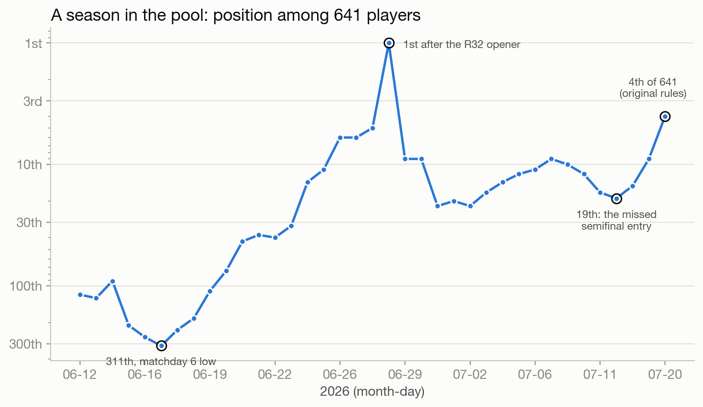
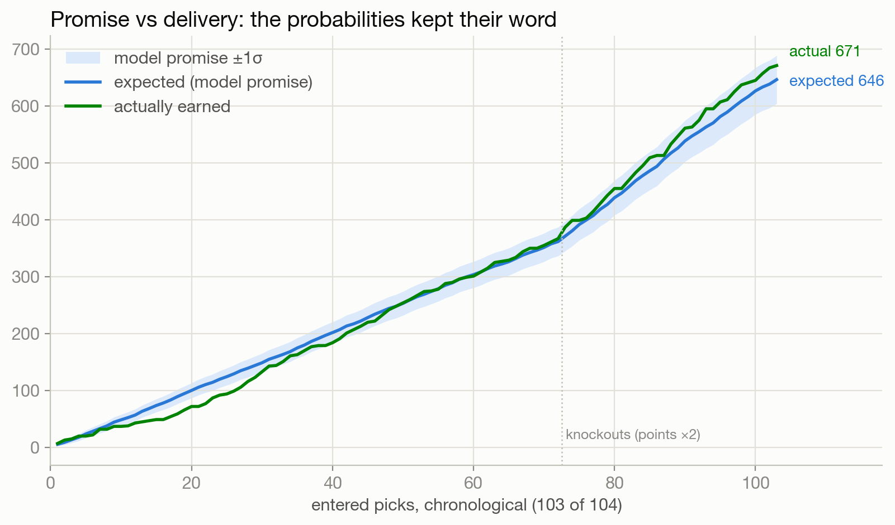
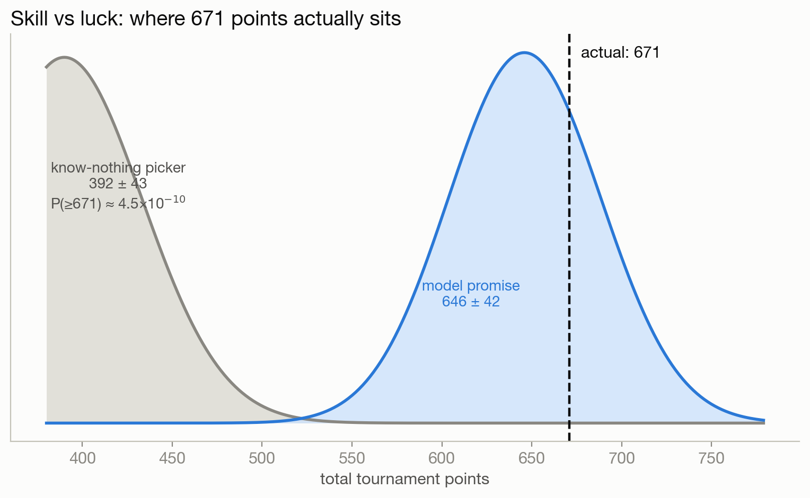
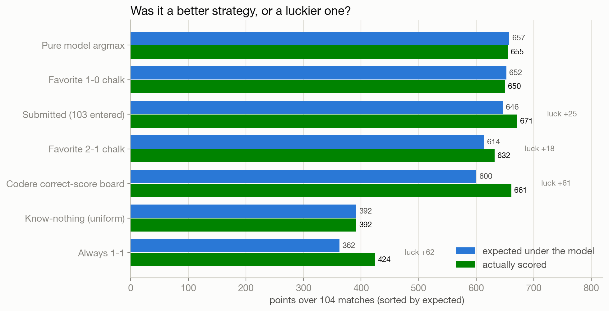
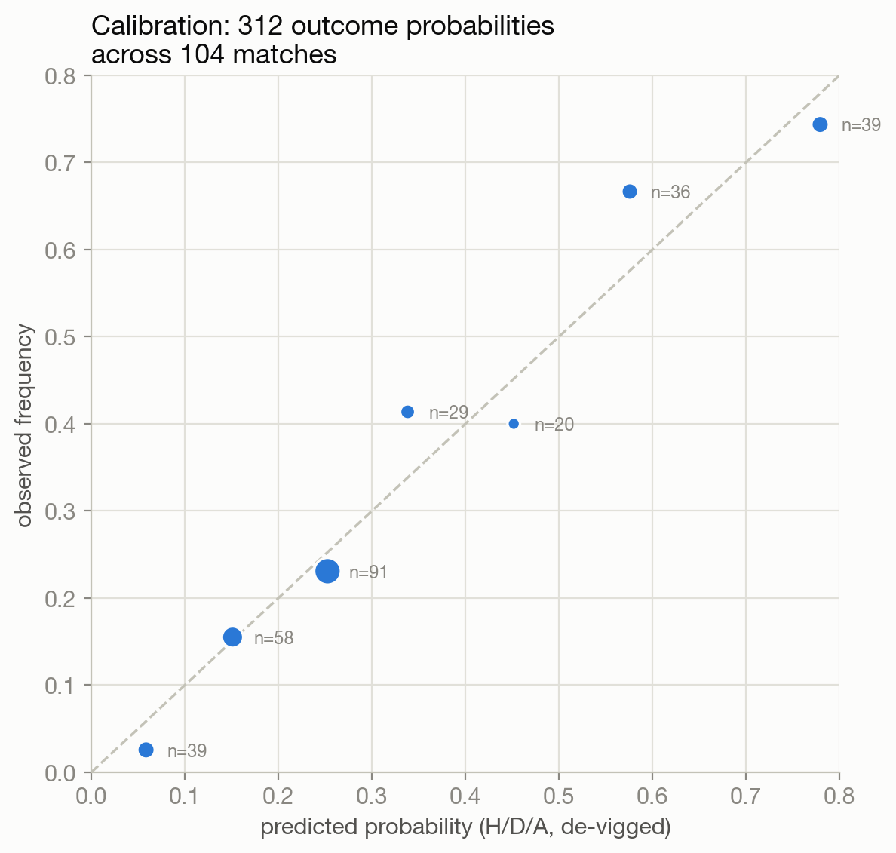

# Post-Mortem: Was It Skill?

The tournament is over. The pool had 641 players, the pot paid the top three,
and this project finished **4th by the rules set at the start** (711 points:
671 from matches, plus 30 for calling Spain champion and 10 for calling England
third). Two points short of the money.

This document asks the only three questions that matter after the fact, and
answers them with the 104-match dataset this repo accumulated. Every
probability was captured **before** kickoff, every result recorded after, and
every claim below regenerates from `analysis/final_report.py`.

1. **Was the result luck?** No: p ≈ 4.5×10⁻¹⁰ against a know-nothing picker.
2. **Did the probabilities keep their word?** Yes: promised 646 ± 42, delivered
   671, z = +0.58.
3. **Where did the edge actually come from?** Not where you'd think. The
   per-match model beats a disciplined human only slightly; the compounding
   edges were the podium bet, the scoring-rule optimization, and the endgame
   pivot.

---

## 1. The season

Bottom half of the table on matchday 6 (311th of ~660). First place, briefly,
after the first knockout match. Then the knockout variance both giveth (a
doubled exact vaulting 5th to 1st) and taketh (two doubled draws, 1st to 9th;
a missed app entry, 17th to 19th). The final week's strategy pivot climbed from
19th to 4th.

## 2. Did the probabilities keep their word?

The model's whole premise was: de-vig the market's probabilities, build a
Dixon-Coles score matrix, and submit the scoreline that maximizes expected
points under the pool's 5/2/2/1 rule (doubled in knockouts). If that machinery
is honest, the points it *promises* (the sum of each pick's expected value)
should match the points it *delivers*, with the difference being luck.

Over the 103 entered picks the model promised **646.3 ± 42.4** points. It
delivered **671**, a **z-score of +0.58**, sitting at the 72nd percentile of
its own exact distribution (computed by convolution, no simulation). The
verdict:

- **The machinery was calibrated.** Delivery sits comfortably inside one sigma
  of promise. There is no hidden overconfidence and no sandbagging.
- **The luck component was +25 points**, mild good fortune of the kind that
  shows up in roughly one tournament out of three. Put plainly: skill earned
  about 646 of the 671, and variance donated the rest.

## 3. Skill vs luck, quantified

Two exact distributions, one axis:

- A **know-nothing picker** (uniform over all 0-3 scorelines, never missing an
  entry, scored against the real 104 results) earns **392 ± 43**. The
  probability of such a picker reaching 671 is **4.5×10⁻¹⁰**, about one in two
  billion. By any conventional threshold (p < 0.05, p < 0.001, take your pick),
  the result is not luck.
- Against the **real field**: among the 24 players whose final scores and
  podium picks were captured, 3 finished above 711 once the original rules are
  applied. Players outside that captured window cannot be ruled out (see the
  blind-spot note in §6), so **4th is the best-supported position rather than a
  certified one**. The defensible claim is "top ~1% of 641."
- Note what the field's own scores prove: the player who finished with the most
  **raw match points** (700, before any podium bonus) held a completely dead
  podium. At least five captured players out-scored this project on raw match
  points. The pool was not won by match-picking alone, and this project did not
  win it there either (see §4 and §7).

## 4. Every strategy, same matches, same results

The shadow data makes honest baselines possible. Every strategy below is scored
on the identical 104 real results.

| Strategy | Points | What it represents |
|---|---:|---|
| Submitted + the missed SF entry | **685** | the model and strategy, executed perfectly |
| **Submitted (as it happened)** | **671** | what actually went to the scoreboard |
| Codere correct-score board | 661 | "just copy the bookmaker's most likely score" |
| Pure model argmax | 655 | the engine with no strategic overlay |
| Favorite 1-0 chalk | 650 | a disciplined fan: favorite wins, 1-0, every time |
| Favorite 2-1 chalk | 632 | the most common human instinct |
| Always 1-1 | 424 | the draw troll |
| Know-nothing (expected) | 392 | random scorelines |

Three honest observations:

- **The per-match model's edge over a disciplined human is real but thin**:
  argmax 655 versus favorite-1-0 chalk 650. Anyone who mechanically picked the
  favorite 1-0 for a month would have finished near the top of this pool. The
  model's per-match advantage comes from knowing *when* the favorite's modal
  scoreline isn't 1-0 (totals-informed lambdas), worth about +5 over 104
  matches. Nobody should sell that as alpha.
- **The strategic overlay was worth +16** (671 versus 655), all of it from the
  final four matches, where the objective switched from maximizing expected
  points to maximizing P(top-3). That meant picking outcomes *correlated* with
  the live podium slots instead of the most likely ones. The deviations went
  3-for-3 on direction: needed Argentina, got it; needed England, got it;
  needed Spain, got it.
- **Execution is a strategy too.** The gap between 685 and 671 is one missed
  phone entry, and it outweighed the entire per-match model edge.

**The honest reading of this table**: a disciplined human with no model, who
mechanically picked the favorite to win 1-0 in all 104 matches, scores 650.
That is within 21 points of a machine that consumed live prediction-market data
for five weeks. The model's advantage is real, reproducible, and *small*. What
separated this project from that hypothetical human was not per-match accuracy.
It was the podium bet (+40) and the endgame pivot (+16), neither of which is a
football-knowledge problem.

## 5. Calibration: trusting the market was correct

The 312 de-vigged outcome probabilities (H/D/A across 104 matches) against what
actually happened:

- **Multiclass Brier score 0.503** versus 0.667 for the uniform baseline, a
  **+24.5% skill score**.
- **Favorites hit 62.5% of the time against 61.1% predicted**, a gap of 1.4
  points. The market was neither over- nor under-confident this tournament.
- **Exact scorelines: 15 hits versus 13.0 expected.** Result type: 67 versus
  62.8 expected. Both sit within noise of promise, so again, calibrated.
- The reliability curve hugs the diagonal in every bucket that has data.

This is the quiet, load-bearing result of the whole project: **the
market-implied probabilities were trustworthy, so every downstream decision
built on them was built on rock.** The edge never came from disagreeing with
the market. It came from *optimizing what the market doesn't care about*, which
is the pool's scoring rule and payout structure.

## 6. The two points

The money was missed by two points. The complete decomposition:

| Event | Swing | Nature |
|---|---|---|
| The missed semifinal app entry | −14 (725 → 711 world) | human error |
| The final landing 0-0 (1-1 pickers gained 8 on us) | variance | priced, accepted |
| A rank-11+ rival's champion and runner-up podium (+50) | rival skill | intel blind spot |
| The endgame pivot (correlation over chalk) | +16 | strategy |
| The podium bet (Spain champion, England third) | +40 | model |

The enumeration before the final modeled the five visible threats and correctly
identified the max-P(money) pick, but it pulled rival podiums only for the
visible top-10. A player sitting 11th or lower with a locked +50 podium bonus
was effectively **2nd all along, and invisible**. With that one extra
screenshot, the optimal pick flips from defending chalk to differentiating, and
the differentiated pick would have cashed. Lesson recorded: *in any endgame,
enumerate everyone within maximum-remaining-bonus of the cut, not everyone you
can see.*

## 7. What this project actually demonstrates

- **Markets are calibrated, so use them.** Free, sharp probability estimates
  beat anything an individual can produce (§5).
- **The edge is in the scoring rule, not the probabilities.** Optimizing
  5/2/2/1-doubled expected value is not the same as predicting the most likely
  score (§4).
- **When the payout is top-k, expected points is the wrong objective.** The
  endgame pivot from max-E to max-P(top-3), picking correlated outcomes, was
  worth more than the entire per-match model edge (§4).
- **Variance is the product, not the enemy.** A 641-player pool is won in the
  tails. A strategy that finishes 4th repeatably will sometimes lose to
  someone's hot month, and that is the correct trade.
- **Process beats model.** The single largest controllable loss was not a
  probability estimate. It was a save button (§6).

---

*Every number here regenerates from the committed CSVs:*
`python analysis/final_report.py`. *Every pick predates its match; see the
release timestamps on the `picks-*` tags.*
